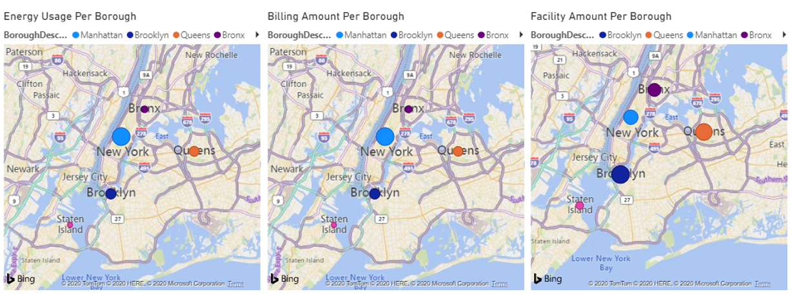
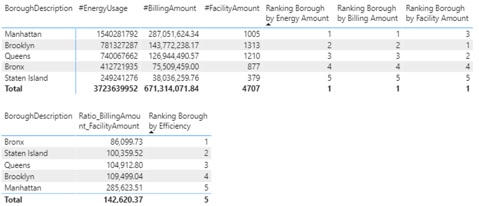

# Business Intelligence

[Energy Cost Analysis](#CUNY_ENERGY) |
[Certifications](#Certifications) |
[Course Overview](#overview)
___ 

### [Energy Cost Analysis](https://github.com/eng-jonathan/Business_Intelligence/tree/main/CUNY%20Energy)
* [Presentation](https://github.com/eng-jonathan/Business_Intelligence/blob/main/CUNY%20Energy/CUNY%20Energy%20Presentation.pdf) | [PBIX File](https://github.com/eng-jonathan/Business_Intelligence/blob/main/CUNY%20Energy/CUNY%20Energy%20PBIX.pbix) 
* Designed ***Data Visualizations*** and ***Interactive Dashboards*** to evaluate energy distribution and costs
* Developed in ***Microsoft Power BI*** and incorporates the use of ***DAX*** abd ***M***
* Highlights

___ 

### [Certifications](https://github.com/eng-jonathan/Business_Intelligence/tree/main/certifications)
* [Power Query Fundamentals](https://github.com/eng-jonathan/Business_Intelligence/blob/main/certifications/Power_Query_Fundamentals.pdf)
* [Power Query Essentials](https://github.com/eng-jonathan/Business_Intelligence/blob/main/certifications/Power_Query_Essentials.pdf)
* [Power Query Advanced](https://github.com/eng-jonathan/Business_Intelligence/blob/main/certifications/Power_Query_Advanced.pdf)
* [Ultimate Beginners Guide to Power BI](https://github.com/eng-jonathan/Business_Intelligence/blob/main/certifications/Ultimate_Beginners_Guide_to_Power_BI.pdf)
* [Ultimate Beginners Guide to Power DAX](https://github.com/eng-jonathan/Business_Intelligence/blob/main/certifications/Ultimate_Beginners_Guide_to_DAX.pdf)
___

### Course Overview:
[Syllabus](https://github.com/eng-jonathan/Business_Intelligence/blob/main/syllabus/syllabus.pdf)
* Research and dissect the visualizations, DAX code, Calculated columns and tables from various professional PBIX files
* Understanding the differences between traditional OLTP and columnar databases
* Client-side loading external data sources to form a client-side data warehouse that (ETL) (extract transform and load using PowerQuery (M)) evolving the creation of various staging queries to shape data efficiently into a BISM (Business Modeling Sematic Model) data model.
* Applying parallels from Relational database SQL skills to functional programming in DAX (Data Analysis Expressions) for PowerBI or PowerPivot.
* Data Analysis expressions (DAX) to create calculated columns, measures and virtual tables using skills learned within the prerequisites
* Create Pivot tables, Charts and Key Point Indicators (KPI)
* PowerBI Desktop and PowerPivot Excel 2019 or better to prototype BISM models
* Use techniques to slice and dice the decision support data to provide the macro to micro perspectives for the business user
* Building and implementing relational databases
___
