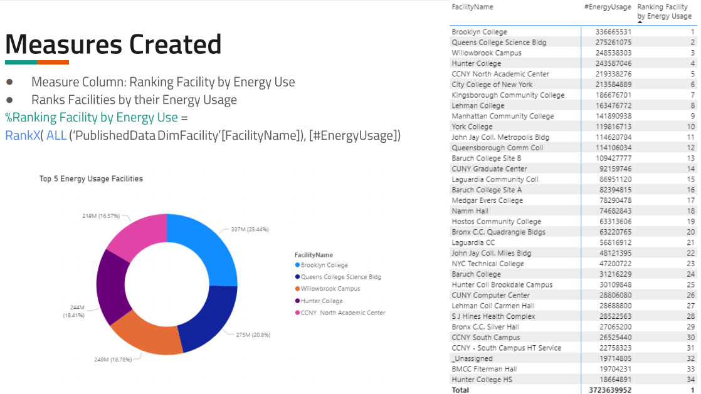
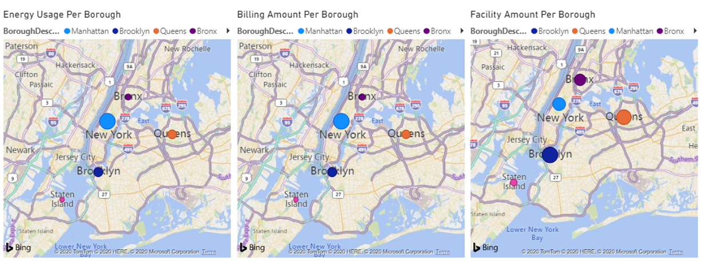
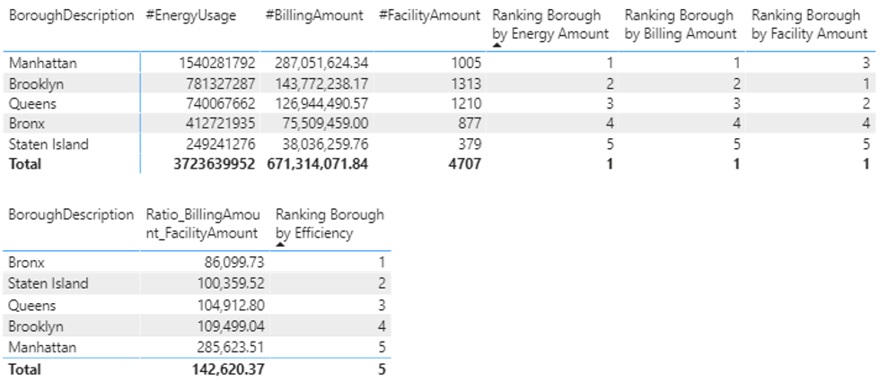

# Energy Cost Analysis
* [Presentation](https://github.com/eng-jonathan/Business_Intelligence/blob/main/cuny%20energy/CUNY%20Energy%20Presentation.pdf) | [PBIX File](https://github.com/eng-jonathan/Business_Intelligence/blob/main/cuny%20energy/CUNY%20Energy%20PBIX.pbix) 
* Designed ***Data Visualizations*** and ***Interactive Dashboards*** to evaluate energy distribution and costs
* Developed in ***Microsoft Power BI*** and incorporates the use of ***DAX*** abd ***M***

### Interesting Findings:
  * Manhattan has an ***Average Facility Amount***, however has the ***Greatest Energy Usage*** and is the ***Least Energy Efficient*** in its Cost/Facility-Count ratio
  * Brooklyn has the ***Most Facility Amount***, however is the ***Second-Least Energy Efficeint***
  * Bronx is the ***Most Energy Efficient***
  * Queens is ***Average*** across the board in terms of Energy Usage, Cost, and Efficiency
  * Staten Island has the ***Least Facility Amount*** trailing second-least by ~40%, and is the ***Second-Most Energy Efficient***

### Highlights:

___
